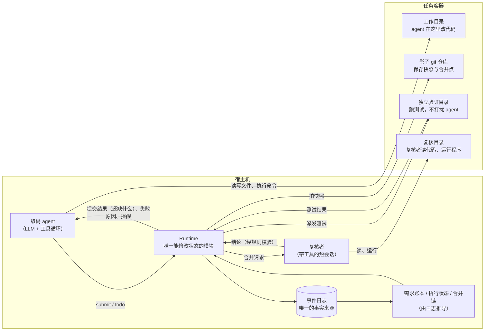
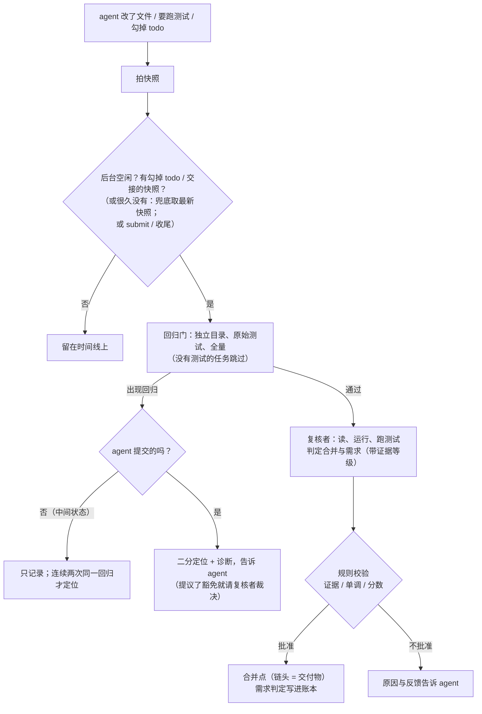
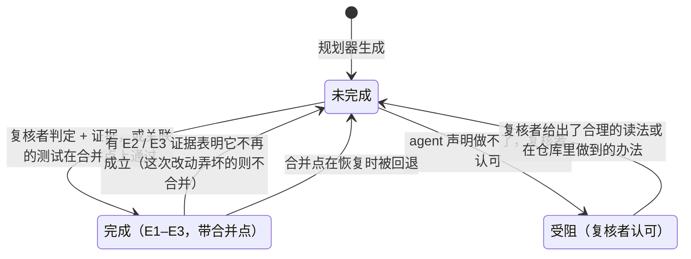
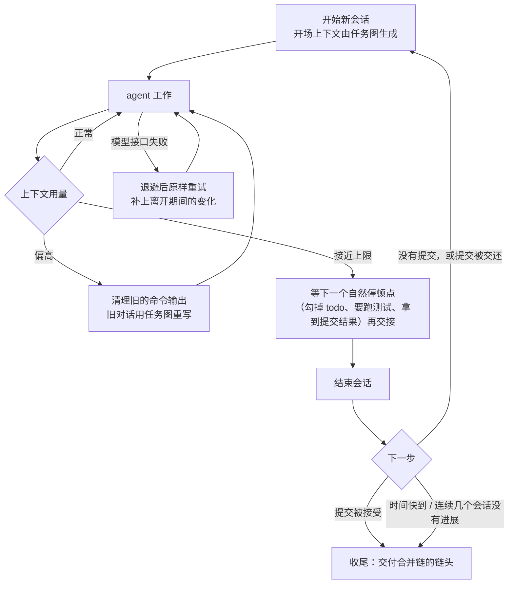

# Belay

**一个让编码 agent 能可靠地完成长时间任务的运行时（runtime），以及一套用来验证它是否真的有用的对比评测框架。**

---

## 背景：agent 在长任务里会怎么失败

现在的编码 agent（如 Claude Code）在几分钟到十几分钟的任务上已经很强，但当任务变成"按一份几十条改动的发布说明，把一个开源项目从一个版本升级到下一个版本"这种需要几十分钟到数小时、跨越多次上下文压缩的工作时，失败方式会明显变化。我们在试跑中观察到的典型问题：

| 问题 | 实际表现 |
| --- | --- |
| **漏做、提前宣布完成** | 一道 22 条改动的题，agent 做了 20 条就宣布完成；漏掉的 2 条恰好对应 8 个评分测试中的 7 个 |
| **回归** | 修好 A 的同时弄坏了 B。"回归"指原本能通过的测试被新改动弄坏；同一道题里 1 个回归就让得分清零 |
| **改测试来"通过"** | 为了让测试变绿，agent 直接修改测试文件、删除断言（一次试跑中改了 27 个测试文件） |
| **压缩后忘事** | 上下文满了被压缩成摘要，之后不记得哪些做完了、哪些验证过、之前为什么这样改 |
| **中断即前功尽弃** | 进程崩溃、容器丢失、超时被杀，工作区停在半成品状态，交不出任何可用结果 |

这些问题的共同根源是：**任务进度只存在于模型的上下文里，而"做完了没有"由模型自己说了算。**

## 核心思路

把任务进度从模型的上下文里搬出来，交给 agent 外部一个由程序维护的**任务状态图**：

- agent 只做编码 agent 本来就会做的事：读、改、跑测试、（可选的）列 todo，做完了调用 `submit`。它不需要认领任务、
  声明步骤或逐个申请验收——这些要模型主动想起来的流程在试跑里被完全忽略过，整张图因此空转。
- 合并是唯一的正式关口：runtime 持续给工作区拍快照，agent 勾掉 todo 时、交接时、agent 调 `submit` 时和收尾时发起合并
  请求（后台优先挑 agent 勾掉 todo 那一刻的快照，很久没有勾 todo 才兜底合并最新快照）——先过回归门（有测试时），再由一个带工具的**复核者**判定“不比上一个合并点差”，同一次复核里逐条
  判定需求做没做完、给出证据等级（测试 / 运行验证 / 代码审读）。通过的快照成为合并点。
- **复核者是唯一的裁判，但必须带证据**：它的结论先由规则校验（引用的测试真的通过、引用的命令真的执行过、豁免的引文
  逐字在任务原文里），合并链是单调的——已完成的需求不会退回、分数不会下降——所以**链头就是最好的结果，交付的永远是
  链头**。agent 的 todo、提交说明都只是线索。
- 没有测试的任务（交付物是产物）走同一条路，只是证据主要来自复核者运行程序、按任务自测的分数。
- 进度、合并点、复核结论都持久化在宿主机上，所以会话可以换、进程可以崩、容器可以丢，任务都能从最近的可靠点接着做。



## 主要设计

### 1. 事件日志是唯一事实来源

所有状态变化（快照被拍、测试跑完、复核结论、合并、需求判定、agent 提交……）都作为事件追加到一条只增不改的日志里。需求账本、执行状态、合并链这三个视图都由纯函数从日志推导出来。

- **可恢复**：崩溃后重放日志就能得到完全一致的状态。
- **可审计**：每个结论都能追溯到是哪条事件、由谁（规则 / 观测 / 模型）产生的。
- **好测试**：所有判断逻辑是纯函数，不做 IO、不调模型、不读时钟，用普通单元测试即可覆盖。

### 2. 需求先拆清楚，最后逐条对账

开工时，规划器（一次 LLM 调用）把任务原文拆成需求清单：每条需求是一段**逐字引用**的原文，标成 actionable（要改代码的）或 context（标题、日期、"代码在 /testbed"这类背景，只为覆盖原文，不进清单），可以带上原代码里已有的测试作为检查项，并写一句**验收方法**（复核者怎么确认它做完了）。程序会校验：引文逐字存在、原文的每一部分都被覆盖、至少有一条 actionable。校验不过就让模型重做，几轮仍不过则退回按行机械切分。需求一旦冻结就不再改动，复核者按需求逐条判定，防止"做了 20 条就说做完了"。

### 3. 复核者是裁判，但必须带证据

复核者每次是一个带工具的短会话：在单独的复核目录里检出被复核的快照，可以读代码、运行命令、让验证器按回归门的方式跑指定测试、在快照之间二分定位，最后给出结构化的结论。证据分四级：

| 等级 | 含义 | 规则怎么校验 | 计为完成 |
| --- | --- | --- | --- |
| E3 测试 | 引用的测试在这个快照上通过（至少一个在原始代码上不通过） | 测试在基线里、在这棵树上有通过的结果 | 是 |
| E2 运行验证 | 复核者执行命令，观察到预期行为或产物 | 引用的命令确实在这次复核里执行过 | 是 |
| E1 代码审读 | 复核者读改动，判断已实现 | — | 是，单独统计 |
| E0 自述 | 只有 agent 的说法 | — | 否 |

不够的等级会被降级；改判一条已经完成的需求必须有 E2 / E3 的证据（只凭阅读的否定不算，防止来回改判）；回归门里的测试只能由复核者在任务原文明确要求新行为时豁免，引文由程序逐字校验。**诊断者**只解释某个测试为什么失败，不改变任何状态。复核者失败时先重试；仍失败就按"复核者不可用"处理：有回归门时只按回归门合并，需求按自述（E0）记下，账本如实区分。

### 4. 合并：存 → 门 → 复核 → 合并点

- **存**：agent 每次实际改动文件、或要跑测试之前，runtime 自动拍一张快照（git 提交），不打扰 agent。
- **门**：对一张快照发起合并请求时，先在独立的验证目录里用**原始测试文件**跑全量回归门：原来能过的测试一个都不能坏。没有测试配置的任务跳过这一步。
- **复核**：过门之后复核者判定"不比上一个合并点差"（没有破坏性改动、已完成的需求没被弄坏、分数没降），同一次复核里逐条判定需求。合并不要求任何需求已经完成，所以进度是增量的。
- **合并点**：通过的快照成为合并点，合并提交的说明就是复核者写的一行标签。合并链单调，**交付的永远是链头**，即使超时被打断，交出去的也是一个复核过的版本，而不是半成品。

后台的合并请求优先挑**边界快照**——agent 勾掉 todo 那一刻的快照（它自己认为做完的一个完整节点），或交接时的快照——哪怕 agent 之后又改了别的东西；勾掉 todo 就触发（距上一次后台复核至少 1 分钟，只防连续勾掉琐碎条目），交接、submit、收尾不受限制。很久没有边界快照时（默认距上一次后台复核 15 分钟）才兜底合并最新的快照，免得进度一直进不了合并链。同一时刻每个 agent 只有一个后台合并请求，后来的 todo 不抢占进行中的复核；合并期间攒下的几个 todo 合成一次，直接合并最新的那一张（快照是累积的，它包含前面的）。只被回归门挡下的中间状态是常态，不打扰 agent；同一个回归连续两次出现、或 agent 提交的版本被拒时，才在快照之间二分定位，告诉 agent 是哪一段改动引入的，并提供一键撤回的工具。复核者没有批准时，原因和反馈会作为提醒送到 agent 那里；连续几次不批准会再给一次提示。



### 5. 需求怎么流转

每条 actionable 需求在账本里有明确的状态，只在合并时由判定改变：



`submit` 是"请现在看一眼"：拍快照 → 合并请求（回归门 → 复核者，结论一定交还 agent）→ 还有没完成的需求就把清单和缺失项**交还** agent，它继续做，再提交；没有就**接受**，运行收尾。快照与链头相同时只请复核者判定还没在这棵树上判定过的需求，不重复复核。agent 停下来不调用任何工具时，先追问一句；再次停下就当作一次提交。

整个运行只有在交付的合并点上每条需求都完成（E1 及以上）、或受阻且复核者认可时才算**真正完成**；只有自述的完成、复核者没认可的受阻都如实记为未完成。

### 6. 会话怎么流转

一个长任务会经历很多次会话。会话结束不等于任务结束，runtime 决定下一步是开新会话、等待验证还是收尾交付。



新会话的开场上下文**主要由任务图生成**：任务原文、需求清单与每条的状态（证据等级、还缺什么）、待处理的问题（未解决的回归、定位结果、被拒的提交与复核者的反馈）、agent 自己的 todo、它在交接时写的摘要、最新合并点以来的改动 diff、离开期间发生了什么。每部分都有长度上限，被折叠的内容留有查询入口，所以即使有几百条需求、上百次会话，开场也不会失控。同样的内容可以随时用 `python -m belay.cli handoff --run-dir <dir>` 从事件库导出，交给下一个会话。

### 7. 三种中断都能恢复

| 中断 | 恢复方式 |
| --- | --- |
| 模型接口多次失败，runtime 还在 | 在内存里原样重试；上下文本身出问题则改开新会话 |
| runtime 进程崩溃，容器还在 | 重放事件日志恢复状态，与 git 和正在运行的测试对账，能接上的测试进程直接接上，对话从磁盘记录恢复 |
| 容器 / 工作区丢失 | 宿主机上持续保存着 git 增量备份，从原始代码重建全部快照和合并点，再从最近的一张快照继续 |

---

## 评测：怎么证明它有用

为了把"runtime 带来的收益"和"agent 本身的能力"分开，我们设计了一组对照，所有组使用同一个模型（DeepSeek）、同样的 90 分钟预算和同一套题目：

| 组 | 说明 | 用来回答的问题 |
| --- | --- | --- |
| Claude Code | 原版 Claude Code | 现成的强 agent 能做到什么程度 |
| Claude Code + 测试拦截 | agent 想结束时自动跑测试，有回归就打回去（最多 5 次） | 只加一个简单的测试门槛够不够 |
| Claude Code + 三段流水线 | 规划 → 执行 → 评审 的常见多 agent 结构 | 常见的多 agent 拆分够不够 |
| 自研 agent | 参照 Claude Code 自己实现，工具和压缩阈值对齐，**没有任务图** | 我们的基础 agent 是否和 Claude Code 相当 |
| **Belay** | 自研 agent + 任务状态图 runtime | runtime 带来了多少收益 |
| Belay 消融 | 分别关掉回归定位、图生成上下文、诊断者与复核者，以及把后台合并换成只在交接时合并 | 每个机制各贡献多少 |

**题目**：从 SWE-EVO（按发布说明完成一次版本升级）、SWE-Bench ProMax（大规模多文件重构，含 Rust / Go / Java）、LHTB（真实终端里的长程任务）中挑选预计需要几十分钟以上的题，共 16 道正式题 + 3 道调试题；另有 2 道 Claude Code 已能解出的简单题作为对照，确认 runtime 在简单任务上不会带来损失。选题依据和每道题的规模见 [`task_selection.md`](task_selection.md)。

**评分**：agent 结束后导出补丁，在**全新容器**里应用补丁并运行题目隐藏的测试，所有组走同一条评分路径。主要指标是修复率：目标测试的通过比例，但只要有一个原本通过的测试被弄坏就记为 0。

**防作弊与防泄漏**：题目容器断网，只放行模型 API；禁用 Claude Code 由服务端执行的网页搜索（试跑中它曾 51 次搜到其他 agent 在同一道题上的运行记录）；删除仓库中目标版本之后的 git 历史；评分时使用原始测试文件，agent 改动测试无效。

> 正式评测的结果会在运行完成后补充。

---

## 快速开始

### 环境

需要 Python（开发与测试使用 3.12）；跑评测时还需要 Docker。

```bash
git clone https://github.com/jyh21377063/belay.git && cd belay
python -m venv .venv && source .venv/bin/activate
pip install datacurve-pier pyyaml anthropic pytest
```

### 运行测试（不需要 Docker 和模型）

```bash
python -m pytest -q
```

约 200 个测试，几分钟跑完。其中包括：随机生成事件序列（含各种复核结论）、验证"重放日志得到的状态"与"实时运行的状态"完全一致；以及用预先写好的模型回复与复核者替身驱动完整运行，覆盖提交与复核、回归定位、中途被杀、从备份重建容器等场景。

### 在一个本地仓库上运行 Belay

```bash
export DEEPSEEK_API_KEY=...

# task.md：任务描述原文；gate.json：测试配置（测试命令、结果解析方式等）
python -m belay.cli run --workdir /path/to/repo --task-file task.md --gate gate.json --run-dir runs/demo

python -m belay.cli resume --run-dir runs/demo                                # 进程崩溃后继续
python -m belay.cli resume --run-dir runs/demo --rebuild --docker <新容器>     # 容器丢失后重建并继续
python -m belay.cli ledger --run-dir runs/demo                                # 查看需求的完成情况与合并链
python -m belay.cli handoff --run-dir runs/demo                               # 导出交接上下文，交给下一个会话
python -m belay.cli run ... --replay runs/demo/llm_record.jsonl               # 回放录制的模型回复，不调用模型
```

运行结束后，`runs/demo/` 下会有事件日志、每个会话与每次复核的完整对话记录（`sessions/`、`reviews/`）、交付补丁 `deliverable.diff` 和需求账本 `ledger.md`。

### 跑评测

评测基于 [Pier](https://pypi.org/project/datacurve-pier/)（一个在 Docker 里批量运行 agent 并评分的框架）。运行配置在 `runs.yaml`，题目清单在 `tasks.yaml`。

```bash
python -m eval.prepare --split dev                           # 生成题目目录（强制断网）
python -m eval.run --profile gold-check -y                   # 先验证题目环境：参考答案能通过、空改动不能通过
python -m eval.run --profile belay-dev --tasks <题目 id>       # 用 Belay 跑一道调试题
python -m eval.run --profile cc-pilot -y                     # 用 Claude Code 跑全部调试题
python -m eval.report results/<run_id>                       # 生成汇总表
```

同一条命令重复执行会自动跳过已完成的部分；加 `--dry-run` 只打印计划不实际运行。

---

## 目录结构

```
belay/
├── core/        纯函数核心：事件、视图推导、状态转换规则、验证规则、上下文构建
├── runtime/     外壳：事件存储、git 快照、测试调度、会话循环、规划器、恢复
├── tools/       agent 可调用的工具（文件、命令行，以及 submit / board 等几个 Belay 工具）
├── worker/      agent 主循环（自研 agent 与 Belay 共用同一份代码，对比才公平）
├── container/   在容器内运行的测试执行脚本（只依赖标准库）
└── cli.py       本地运行入口
eval/            评测框架：题目转换、运行编排、补丁重放评分、汇总
tests/           单元测试与端到端测试
docs/            详细设计文档
```

## License

[Apache-2.0](LICENSE)
