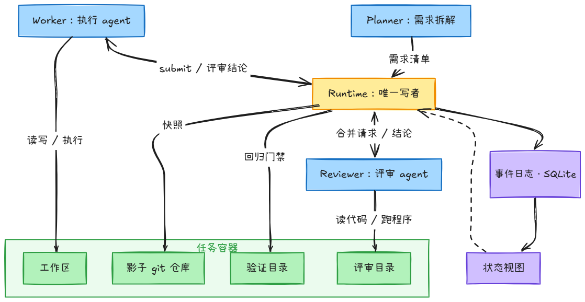
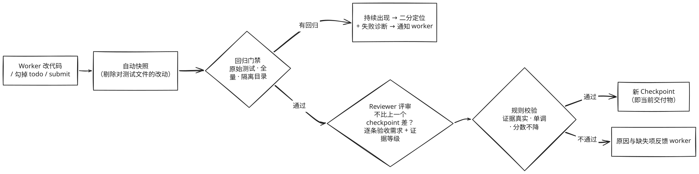
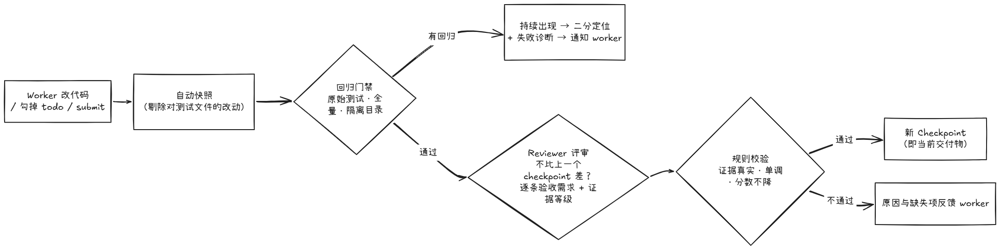

# Belay

**面向长程编码任务的 Agent Runtime：让编码 agent 在几十分钟到几小时的任务里不漏做、不回归、不作弊、断了能接着干，并且无论何时停下，交付的都是一个经过验证的版本。**

> *Belay* 是攀岩里的“保护”：攀登者（agent）只管往上爬，保护者（runtime）在每个可靠的位置挂上保护点（checkpoint），失手也只会落回最近的那个点。

---

## 1. 问题：编码 agent 在长任务上怎么失败

Claude Code 这类编码 agent 在十几分钟内能完成的任务上已经很强。但当任务变成“照着一份几十条改动的 release notes，把一个开源项目升级到下一个版本”这种需要几十分钟到几小时、要经历多次上下文压缩的工作时，失败方式会明显变化。我们在试跑中反复看到：

| 失败模式 | 真实案例 |
| --- | --- |
| **漏做却宣布完成** | 22 条改动做了 20 条就说完成，漏掉的 2 条恰好对应 8 个评分测试中的 7 个 |
| **回归** | 修好 A、弄坏 B；在 SWE-EVO 这类评分里，一个回归就能让整道题得 0 分 |
| **改测试来“通过”** | 为了让测试变绿直接改测试、删断言，一次试跑改了 27 个测试文件 |
| **压缩后失忆** | 上下文被压缩成摘要后，不记得哪些做完了、哪些验证过、为什么这样改 |
| **中断即归零** | 进程崩溃、容器丢失、超时被杀，工作区停在半成品状态，交不出可用结果 |

这些问题有一个共同根源：**任务进度只存在于模型的上下文里，而“做完了没有”由模型自己说了算。**

## 2. 我们做了什么

Belay 把“进度”和“验收”从模型手里拿出来，交给一个外部的、由程序维护的 runtime。思路可以直接类比软件团队的协作流程：

| 软件团队 | Belay |
| --- | --- |
| 开发者在自己的分支上写代码 | **Worker**（执行 agent）在工作区里自由地读、改、跑测试 |
| 每次提交都留下记录 | Runtime 在工具调用边界**自动拍快照**（影子 git 仓库，不打扰 worker） |
| 提 PR → 跑 CI → Code Review → 合进 main | 快照发起**合并请求** → **回归门禁** → **Reviewer**（带工具的评审 agent）→ 成为 **Checkpoint** |
| main 分支只前进、总是可发布 | Checkpoint 链**单调**：已完成的需求不会退回、分数不会下降，**任何时刻交付的都是最新 checkpoint** |
| 需求单 + 验收标准 | **Planner** 把任务原文拆成**需求清单**，Reviewer 逐条验收并给出**证据等级** |

在此之上，Belay 还做了：

- **证据驱动的验收**：Reviewer 是唯一的裁判，但它的每个结论都要经过确定性规则校验——声称“测试通过”，那个测试必须真的在这棵代码树上通过；声称“运行验证过”，那条命令必须真的执行过；只靠读代码，推翻不了一条已经验收通过的需求。
- **防作弊**：回归门禁永远用原始测试文件；worker 对测试文件的改动在合并前被剔除；想豁免某个回归，必须逐字引用任务原文中要求改变该行为的句子，并由 Reviewer 裁决。
- **回归自动定位**：同一回归持续出现时，在快照之间自动二分（类似 `git bisect`），告诉 worker 是哪一段改动引入的，并提供一键撤回。
- **上下文工程**：新会话的开场上下文由 runtime 从任务状态生成（而不是靠模型写的摘要），配合 L0–L4 分层压缩，几百条需求、上百次会话也不会失控。
- **三级故障恢复**：模型接口失败、runtime 进程崩溃、容器整个丢失，都能从最近的可靠点恢复并继续。
- **可控的对照评测框架**：同一模型下对比 Claude Code、Claude Code + 测试门禁、Claude Code + Planner/Executor/Evaluator 流水线、自研基线 agent，并支持逐个机制的消融。

## 3. 设计与架构

### 核心设计原则

1. **Event Sourcing**：所有状态变化都是一条只追加的事件；需求清单、执行状态、checkpoint 链都是事件日志的投影。崩溃后重放即可恢复，每个结论都能追溯到哪条事件、来自谁（观测 / 规则 / 模型 / agent 自述）。
2. **Functional Core, Imperative Shell**：所有判定逻辑是纯函数（不做 IO、不调模型、不读时钟），由依赖检查测试强制保证；副作用只能由已经落盘的事件触发。
3. **模型提议，规则裁决**：Planner、Reviewer 的输出都只是“提议”，经规则校验后才能改变状态；worker 的 todo、提交说明只是线索。
4. **不改变 agent 的工作方式**：worker 只做编码 agent 本来就会做的事（读、改、跑测试、列 todo、做完了 `submit`），不需要学习任何新流程。

### 系统架构



### 一个快照如何成为 Checkpoint





更完整的架构说明见 [docs/architecture.md](docs/architecture.md)，每个模块的详细设计见 [docs/design.md](docs/design.md)。

## 4. 评测结果（节选）

正式集共 16 道题：SWE-EVO 6 道（按 release notes 完成一次版本升级）、LHTB 10 道（真实终端里的长程任务，含 3 道负对照）。对照组为本地 Claude Code，两组使用同一个模型（DeepSeek V4 Flash）。

**亮点**

| 题目 | Belay | Claude Code | 说明 |
| --- | --- | --- | --- |
| SWE-EVO · dask 2023.3.2 | **52 / 61** F2P | 20 / 61 F2P | 目标测试通过数约 **2.6 倍** |
| SWE-EVO · dvc 2.8.1 | 16 / 133 F2P，**0 个回归** | 15 / 133 F2P，31 个回归 | 回归门禁的效果最直接 |
| LHTB · vector-db | **0.921** | — | 参考解 0.866，**超过参考解** |
| LHTB · generals | **0.960** | — | 参考解 0.850，**超过参考解** |
| LHTB · grammar-fuzz | **0.948** | — | 参考解 0.917，**超过参考解** |

**总体**

| | Belay 更好 | 持平 | Claude Code 更好 |
| --- | --- | --- | --- |
| SWE-EVO（6 道） | 1 | 4 | 1 |
| LHTB（两组都有结果的 7 道） | 0 | 6 | 1 |

- **回归更少**：6 道 SWE-EVO 中，Belay 有 2 道回归明显更少（0 vs 31、1 vs 2），2 道相同，2 道各多 1 个。
- **简单题不拖后腿**：3 道负对照题 Belay 均与参考解持平或更高。
- **Checkpoint 链兜住了分数**：commit0 运行中间的 checkpoint 分别得 0.941 → 0.924 → 0.946，分数会波动，但交付物永远不低于最新 checkpoint。
- **下一步的方向很清楚**：对中间版本单独评分显示，worker 的代码产出与 Claude Code 相当，失分主要来自 runtime 的验收与交付环节——Reviewer 把关过严或误判、大仓库上收尾交付不够可靠，这正是下一步要改进的地方。

> 口径说明：Belay 每题报所有运行中的最高分、预算 180 分钟；Claude Code 每题 1 次运行、预算 90 分钟。因此 0.01–0.03 以内的差距按持平处理。

**完整结果、评分口径、每道题的来源标记与待核实项见 [docs/results.md](docs/results.md)。**

## 5. 快速上手

```bash
pip install datacurve-pier pyyaml anthropic pytest
python -m pytest -q                      # ~280 个测试，不需要 Docker 和模型

export DEEPSEEK_API_KEY=...
python -m belay.cli run --workdir /path/to/repo --task-file task.md --gate gate.json --run-dir runs/demo
python -m belay.cli resume --run-dir runs/demo     # 进程崩溃后继续
python -m belay.cli ledger --run-dir runs/demo     # 查看需求清单与 checkpoint 链
```

## License

[Apache-2.0](LICENSE)
