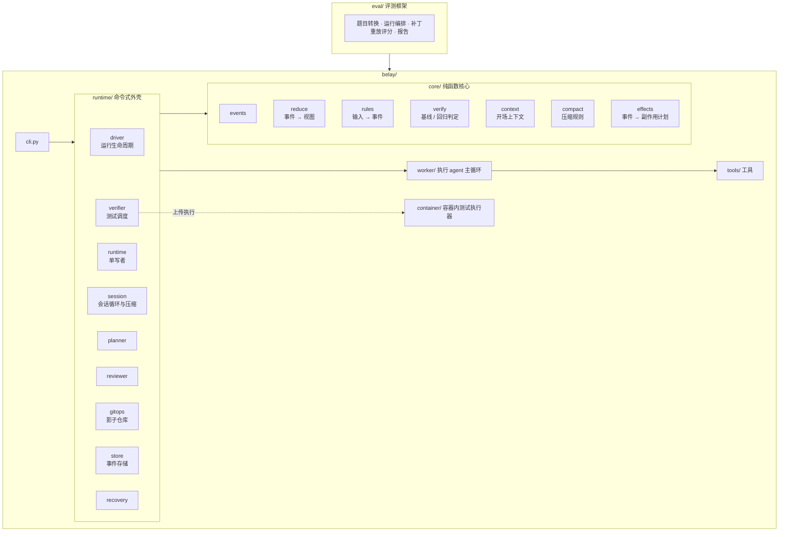
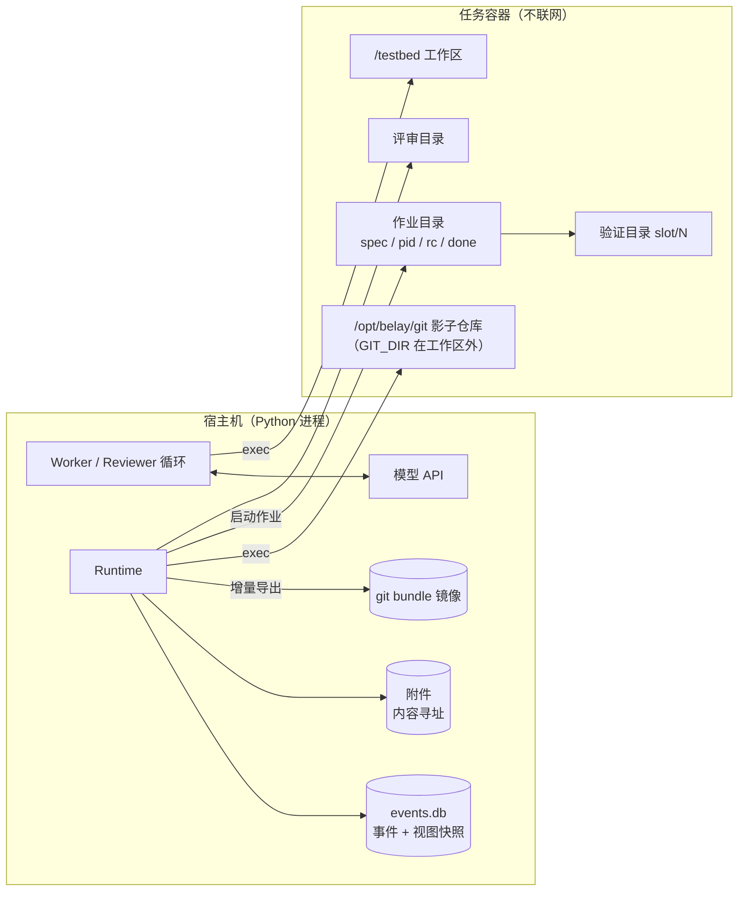
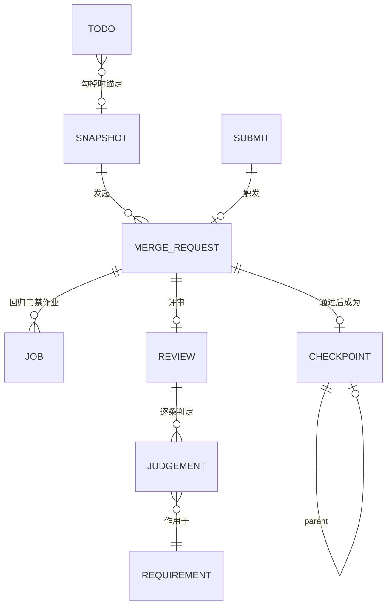
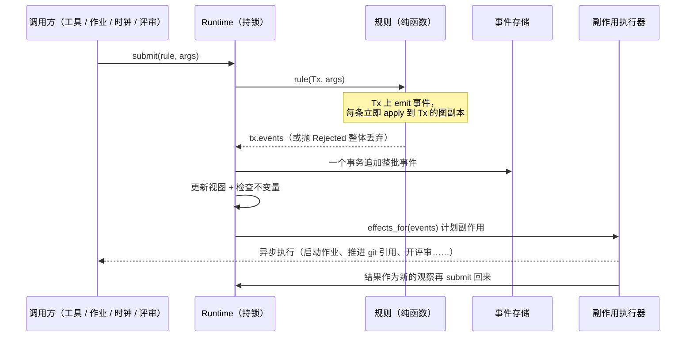
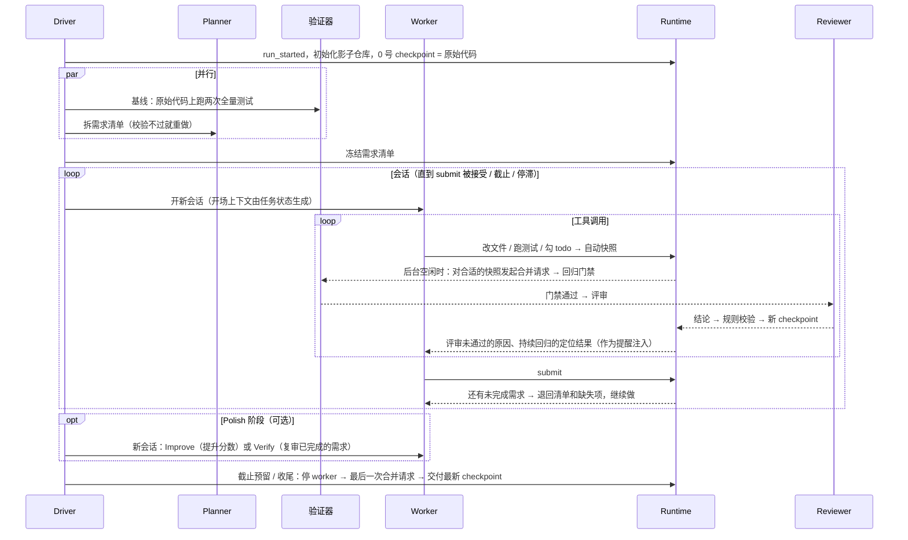

# Belay 架构文档

本文从整体上说明 Belay 是什么、由哪些部分组成、它们之间怎么协作，以及几个关键的设计取舍。每个模块的实现细节见 [design.md](design.md)，评测结果见 [results.md](results.md)。

- [1. 设计目标](#1-设计目标)
- [2. 术语表](#2-术语表)
- [3. 角色与职责](#3-角色与职责)
- [4. 分层架构](#4-分层架构)
- [5. 部署视图](#5-部署视图)
- [6. 数据模型](#6-数据模型)
- [7. 控制流：单写者事务](#7-控制流单写者事务)
- [8. 一次运行的生命周期](#8-一次运行的生命周期)
- [9. 并发模型](#9-并发模型)
- [10. 持久化与恢复](#10-持久化与恢复)
- [11. 关键设计取舍](#11-关键设计取舍)
- [12. 可配置性与消融](#12-可配置性与消融)

---

## 1. 设计目标

Belay 针对的是**几十分钟到几小时、需求条目多、会经历多次上下文压缩**的编码任务（例如按 release notes 完成一次版本升级）。在这类任务上，编码 agent 的主要失败是漏做、回归、改测试作弊、压缩后失忆、中断后交不出结果（见 [README](../README.md#1-问题编码-agent-在长任务上怎么失败)）。对应地，Belay 的目标是：

| # | 目标 | 对应机制 |
| --- | --- | --- |
| G1 | **不漏做**：每条需求都有明确的完成状态，且完成要有证据 | Planner 拆需求清单；Reviewer 逐条验收；证据等级与规则校验 |
| G2 | **不回归**：交付物不能弄坏原本能用的功能 | 回归门禁；单调的 checkpoint 链；二分定位 |
| G3 | **不作弊**：不能靠改测试、编造验证来“通过” | 原始测试文件跑门禁；合并前剔除测试改动；证据与引文逐字校验 |
| G4 | **不失忆**：换多少次会话都知道做到了哪 | 进度在 runtime 而不在上下文；开场上下文由状态生成；分层压缩 |
| G5 | **随时可交付**：任何时刻停下，交出的都是验证过的版本 | 交付最新 checkpoint；截止时间预留；三级故障恢复 |
| G6 | **可证明有用**：收益可以和 agent 本身的能力分开度量 | 同模型对照组；共用 worker 代码的自研基线；机制级消融开关 |

**非目标**：Belay 不替代编码 agent 本身的能力（读代码、写代码、调试仍由 worker 完成），也不要求 agent 学习新的工作流程。

## 2. 术语表

为了让熟悉 Git 协作流程的工程师一眼看懂，Belay 的概念尽量对齐“开发者 + CI + Code Review + 受保护主分支”这套模型。

| 术语 | 含义 | 类比 |
| --- | --- | --- |
| **Worker** | 执行 agent：LLM + 工具循环，负责读代码、改代码、跑测试 | 开发者 |
| **Planner** | 开工时把任务原文拆成需求清单的一次 LLM 调用 | 需求分析 |
| **Reviewer** | 带工具的评审 agent：检出快照，读代码、跑程序、跑测试，给出结构化结论 | Code Reviewer |
| **Diagnoser** | 解释某个测试为什么失败的一次 LLM 调用，只提供信息，不改变状态 | 故障分析 |
| **Runtime** | 唯一能修改状态的模块：运行规则、写事件、执行副作用 | CI/CD 平台 |
| **需求清单**（Requirement Checklist） | 每条需求 = 一段逐字引用的任务原文 + 验收方法 + 状态 + 证据等级 | 需求单 / 验收清单 |
| **证据等级** E0–E3 | 判定“完成”所依据的证据强度：自述 / 代码审读 / 运行验证 / 测试 | — |
| **快照**（Snapshot） | runtime 在工具调用边界自动拍下的工作区状态（一个 git tree） | 分支上的 commit |
| **合并请求**（Merge Request） | 请求把某张快照提升为 checkpoint | PR |
| **回归门禁**（Regression Gate） | 用原始测试文件在隔离目录全量跑“基线上通过的测试”，一个都不能挂 | CI 检查 |
| **Checkpoint** | 通过门禁和评审的快照；checkpoint 链单调前进，最新的就是交付物 | 受保护的 main 分支上的提交 |
| **Waiver**（豁免） | 任务原文明确要求改变某个旧行为时，经 Reviewer 裁决，从门禁里移除对应测试 | 有审批的规则豁免 |
| **Submit** | worker 声明“我做完了，请现在验收”；结论一定返回给 worker | 请求 Review |
| **Handoff**（会话交接） | 上下文接近上限时结束当前会话，由新会话接着做 | 换班交接 |
| **Polish 阶段** | 需求全部验收后、截止之前的打磨阶段（Improve：继续提升分数；Verify：复审已完成的需求） | 发布前的加固 |
| **影子 git 仓库**（Shadow Repo） | GIT_DIR 在工作区之外的独立 git 仓库，存快照和 checkpoint，worker 看不到 | — |

## 3. 角色与职责

Belay 里有四类 LLM 角色和一个确定性的 Runtime。设计上的关键是**权限分离**：谁能改代码、谁能下结论、谁能改变状态，被严格分开。

| 角色 | 能做什么 | 不能做什么 | 看到什么 |
| --- | --- | --- | --- |
| **Worker** | 读写工作区、执行命令、维护 todo、`submit`、撤回被定位的改动 | 不能修改任何状态；看不到影子仓库和 runtime 目录 | 由 runtime 生成的开场上下文 + 自己的对话 |
| **Planner** | 提议需求清单 | 提议必须通过规则校验才会被冻结 | 任务原文、仓库中已有的测试 |
| **Reviewer** | 在评审目录里读代码、跑命令、跑指定测试、二分定位，输出结构化结论 | 不能修改 worker 的工作区；结论必须通过规则校验 | 任务原文、需求清单、按需求排序的 diff、门禁结果；**看不到** worker 的上下文 |
| **Diagnoser** | 解释失败原因 | 不改变任何状态 | 定位到的 diff 与失败日志 |
| **Runtime** | 运行规则、写事件、调度测试、推进 checkpoint、开启和结束会话、交付 | 不调用模型做判断（判断在规则或 LLM 角色里） | 全部状态 |

Reviewer 看不到 worker 的上下文，这是刻意的：它像一个独立的 Code Reviewer，只根据代码和运行结果下结论，不会被 worker 的自我陈述带偏。

## 4. 分层架构



依赖规则由 `tests/unit/test_layering.py` 自动检查，违反即测试失败：

| 包 | 约束 | 目的 |
| --- | --- | --- |
| `belay/core` | 不依赖 runtime / worker / tools / llm / env；不 import 任何做 IO 或读时钟的模块（`os`、`time`、`asyncio`、`sqlite3`……） | 判定逻辑可重放、可单元测试 |
| `belay/tools` | 不认识 runtime 与 core 的内部实现，只通过 `ToolContext.runtime` 提交请求 | 工具可以在基线 agent 和 Belay 之间复用 |
| `belay/worker` | 不依赖 runtime 与 core | 自研基线 agent 是干净的对照组 |
| `belay` | 不依赖 `eval` | 运行时与评测解耦 |
| `belay/container` | 只用标准库，兼容 Python 3.6 | 能上传到任意任务容器里执行 |

## 5. 部署视图



- **所有循环都跑在宿主机上**，工具通过 `Env.run` 在容器里执行。容器里只需要 bash 和 coreutils，不需要 Python 环境，也不需要网络（模型调用从宿主机发出）。`Env` 有三个实现：评测用的 `PierEnv`、本地开发的 `LocalEnv`、调试保留容器用的 `DockerEnv`。
- **影子仓库**的 GIT_DIR 在工作区之外、work tree 指向工作区，所以仓库自己的 `.git` 不受影响（worker 用 `git diff` 看到的仍是相对原始提交的改动），非 git 目录也走同一套代码。
- **验证目录与评审目录**都从影子仓库导出代码树，测试和评审不碰 worker 的工作区，worker 可以一边继续写代码，后台一边验证。
- **宿主机持有所有真相**：事件日志、视图快照、附件、git bundle 都在宿主机上，所以容器丢了也能重建。

## 6. 数据模型

### 6.1 事件

所有状态变化都是一条事件，追加到只增不改的日志里：

```
Event(seq, t, type, actor, source, payload)
```

- `seq` 连续递增，也是状态的版本号；
- `actor` 是谁产生的（`runtime` / `verifier` / `planner` / `reviewer` / `diagnoser` / `worker:w1`……）；
- `source` 是这条信息的**可信度来源**，只有四种：

| source | 含义 | 例子 |
| --- | --- | --- |
| `observed` | runtime、验证器、git 亲眼看到的 | 快照被拍、测试跑完、checkpoint 落地 |
| `rule` | 由确定性规则算出，包括**校验过的** LLM 结论 | 合并决定、需求判定、豁免 |
| `llm` | 模型的原始产出，只做记录 | Reviewer 的原始结论、诊断结果 |
| `self_report` | worker 通过工具报告的内容 | todo 更新、submit 说明 |

每种事件类型都声明了**允许的来源**（`core/events.py` 的 `EVENT_SPECS`），格式检查会拒绝来源不合法的事件。例如 `requirement_judged`、`merged`、`waiver_granted` 都不能来自 `llm`：Reviewer 的结论先原样记为 `merge_reviewed`（`llm`），再由规则校验后另写 `review_decided`、`requirement_judged`（`rule`）。**这是“模型提议、规则裁决”在数据层面的保证。**

### 6.2 三个视图

事件通过纯函数 `reduce.apply(graph, event) → graph'` 投影成三个视图，统称任务状态（`Graph`，全部是不可变 dataclass，结构共享）：

| 视图 | 内容 | 主要实体 |
| --- | --- | --- |
| **需求清单** | 每条需求的状态、证据等级、缺失项、所在 checkpoint；Polish 阶段的改进项 | `Requirement`、`Improvement` |
| **执行状态** | 会话、快照时间线、测试作业、todo、submit、停滞记录、压缩记录 | `Session`、`Snapshot`、`Job`、`Todo`、`Submit` |
| **Checkpoint 链** | 合并请求、评审、checkpoint、豁免、回归定位与诊断 | `Attempt`、`Review`、`Checkpoint`、`Waiver`、`Locate` |

### 6.3 核心实体的关系



## 7. 控制流：单写者事务

Runtime 是**唯一的写者**。所有组件（worker 的工具、测试作业、时钟、会话驱动、Reviewer）都只能通过 `Runtime.submit(rule, *args)` 改变状态：



这套结构带来几个直接的好处：

- **先写事件，再做副作用**：副作用只从已经落盘的事件推出，崩溃后重放就知道哪些副作用该做、哪些已经做了；
- **不需要别的并发控制**：一把锁里完成“规则 → 事件 → 视图 → 不变量”，规则里后面的判断看到的是前面事件之后的状态；
- **reduce 是状态机的最后一道防线**：不合法的转换（例如在不在链上的 checkpoint 上判定完成）会抛 `IllegalEvent`；规则只产生合法事件，所以一条被接受过的日志重放时永远不会抛出；
- **不变量在每个事务边界检查**（`core/invariants.py`），测试里每个事务之后都检查。

副作用的种类是有限且显式的（`core/effects.py`）：`launch_job`、`advance_ref`、`mirror_checkpoint`、`restore_workspace`、`deliver`、`stop_workers`、`cancel_orphans`、`locate_diff`、`diagnose`、`review`、`cancel_review`。

## 8. 一次运行的生命周期



会话结束不等于运行结束。Driver 每次都问一次纯函数 `next_step(状态)`：开新会话、接上会话、等待验证，还是收尾交付。

## 9. 并发模型

Belay 里同时在跑的东西不少：worker 的会话、后台的回归门禁、Reviewer 会话、二分定位、诊断。它们之间不共享可变状态，只通过事件日志交汇：

- **worker 不等后台**：快照、门禁、评审都在后台进行，worker 继续写代码；只有 `submit` 会等待结论（有上限）。
- **后台不碰工作区**：门禁在验证目录、评审在评审目录，都从影子仓库导出代码树。导出前用一个“破坏探针”检查导入隔离是否真的生效（破坏一个被测试导入的源文件，对应测试必须失败）；隔离无效时降级为独占工作区的模式。
- **测试调度是可抢占的优先级队列**：1 档是收尾与基线，2 档是有人在等的（submit 的门禁、Reviewer 要的测试、定位），3 档是后台合并请求的门禁，4 档是已被取代但还在跑的作业。高档作业到达时可以抢占 3、4 档的槽位，被抢占的作业重新排队。
- **作业按 (代码树, 测试集合) 去重**：同一棵树上跑过的测试结果直接复用。

## 10. 持久化与恢复

| 存储 | 位置 | 内容 |
| --- | --- | --- |
| 事件日志 | 宿主机 SQLite（另写一份 `events.jsonl` 便于人看） | 唯一真相 |
| 视图快照 | 同一个 SQLite | 加速恢复：加载最近的快照再重放之后的事件 |
| 附件 | 宿主机，内容寻址 | 大工具输出、diff、补丁 |
| 会话轨迹 | 宿主机 JSONL，逐条 flush | 每条追加进对话的消息，可读盘重放 |
| git bundle | 宿主机，增量导出 | 快照与 checkpoint 的全部 git 对象 |

三类中断对应三级恢复：

| 中断 | 恢复方式 |
| --- | --- |
| 模型接口多次失败，runtime 还在 | 退避后在内存里原样重试同一会话，并补上离开期间的变化 |
| runtime 进程崩溃，容器还在 | 视图快照 + 重放事件 → 与 git 引用、在跑的测试对账 → 能接上的测试进程直接接上 → 对话从磁盘轨迹恢复 |
| 容器 / 工作区丢失 | 从原始代码重建影子仓库（树哈希必须等于 0 号 checkpoint）→ 依次导入 bundle → 校验每个 checkpoint 与快照 → 工作区检出为最近一张快照 → 继续 |

细节见 [design.md §11](design.md#11-故障恢复)。

## 11. 关键设计取舍

**为什么不让 agent 显式地认领任务、申报步骤？**
早期版本让 worker 认领需求、声明步骤、逐个申请验收。试跑中模型几乎完全忽略这些流程，整个任务图因此空转。教训是：**任何需要模型“主动想起来”的流程都不可靠。**所以现在 worker 只做编码 agent 本来就会做的事，进度由 runtime 从快照、测试结果和评审结论里**观察**出来；todo 被保留下来，是因为勾掉 todo 是模型本来就会做的动作，正好可以作为“一个完整改动做完了”的时机信号。

**为什么需要 Reviewer，而不是只看测试？**
很多需求没有现成的测试（新功能、行为变更），LHTB 这类任务的交付物甚至是产物而不是测试。只靠测试，要么大量需求无法验收，要么只能相信 agent 自述。Reviewer 能跑程序、看输出，把证据从“自述”提升到“运行验证”。

**那为什么 Reviewer 的结论还要规则校验？**
Reviewer 也是 LLM，同样会出错、会偷懒。规则校验让它的结论**可证伪**：声称的测试必须真的通过，声称的命令必须真的执行过，豁免引用的原文必须逐字存在。它判断“做没做完”的自由度很大，但不能凭空制造证据。

**为什么 checkpoint 链必须单调？**
长任务里分数会波动（commit0 的中间 checkpoint 依次是 0.941、0.924、0.946）。单调链保证“越往后越不差”，于是**交付最新 checkpoint 永远是对的**，超时、崩溃、被杀都不会让交付物变差。

**为什么开场上下文由状态生成，而不是让模型写摘要？**
模型写的摘要会遗漏、会美化、会把“我觉得做完了”写成“做完了”。由 runtime 生成的开场上下文来自经过验证的状态：需求的真实状态与缺失项、未解决的回归、最新 checkpoint 以来的 diff。模型的交接摘要只作为补充。这也是消融实验里的一个开关（`graph_context`）。

**为什么快照在工具边界自动拍？**
快照不需要 worker 配合，也不影响它的节奏；有了足够细的快照时间线，回归定位才能在快照之间二分，worker 也能一键撤回到某个好的状态。

**为什么合并时机绑定在“勾掉 todo”上？**
评审一次要几分钟，不可能每张快照都评。勾掉 todo 的那一刻，正是 agent 自己认为“一个完整的改动做完了”的时刻，这时的快照最可能是一个自洽的状态。很久没有勾 todo 时，再按时间兜底合并最新快照，保证进度能进入 checkpoint 链。

## 12. 可配置性与消融

所有阈值和机制开关集中在 `core/config.py` 的 `BelayConfig`（纯数据，core 与 runtime 共用）。每个机制都能单独关掉，用于消融实验：

| 开关 | 关掉之后 |
| --- | --- |
| `reviewer=False` | 没有 Reviewer：合并只看回归门禁；需求只能由测试（E3）或 worker 自述（E0）记录 |
| `graph_context=False` | 开场上下文改用模型写的完整摘要 |
| `locate=False` | 合并被拒时不做二分定位 |
| `diagnoser=False` | 不做 LLM 诊断，worker 只拿到规则定位的结果 |
| `background=handoff / off` | 后台只在会话交接时合并 / 只在 submit 与收尾时合并 |
| `protect_tests=False` | 合并时不剔除对测试文件的改动 |
| `confirm_regressions=False` | 回归不重跑确认（不识别 flaky） |
| `stall=False` | 不做停滞检测 |
| `after_accept=finalize / improve / polish` | 需求全部完成后：直接收尾 / 同会话继续改进 / 新会话进入 Polish |
