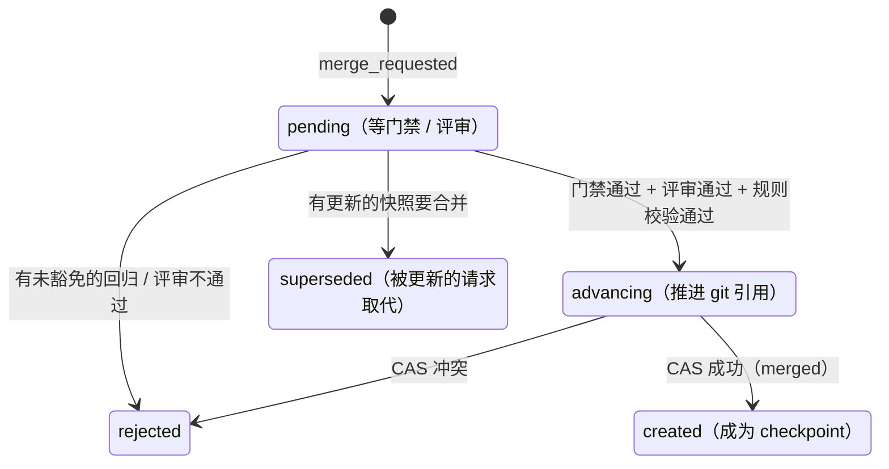
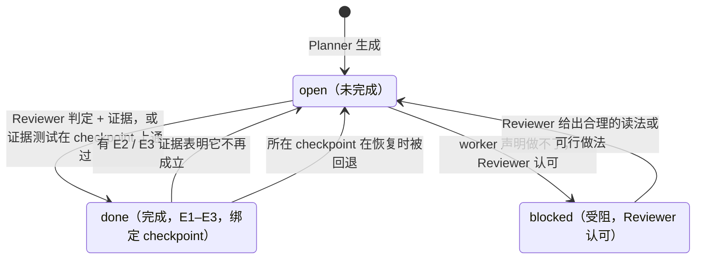
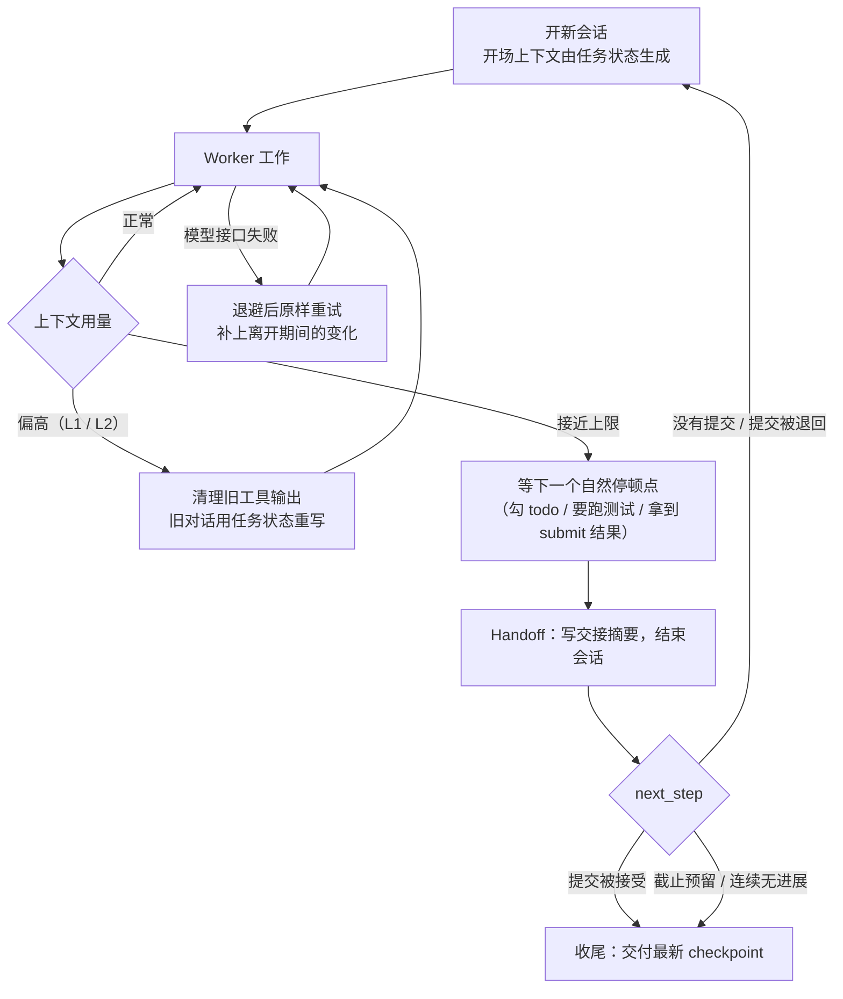

# Belay 详细设计

本文逐个模块说明 Belay 的设计：每一块解决什么问题、怎么做、为什么这样做。整体架构与术语见 [architecture.md](architecture.md)，评测结果见 [results.md](results.md)。文中的配置项都在 `belay/core/config.py`，括号里是默认值。

- [1. Planner：需求拆解与校验](#1-planner需求拆解与校验)
- [2. 快照](#2-快照)
- [3. 基线与回归门禁](#3-基线与回归门禁)
- [4. 合并请求：时机与调度](#4-合并请求时机与调度)
- [5. Reviewer：评审会话](#5-reviewer评审会话)
- [6. 证据等级与规则校验](#6-证据等级与规则校验)
- [7. Waiver：有据可查的回归豁免](#7-waiver有据可查的回归豁免)
- [8. 回归定位、诊断与撤回](#8-回归定位诊断与撤回)
- [9. Submit 协议与需求状态机](#9-submit-协议与需求状态机)
- [10. 会话与上下文管理](#10-会话与上下文管理)
- [11. 故障恢复](#11-故障恢复)
- [12. Polish 阶段](#12-polish-阶段)
- [13. 截止时间与交付](#13-截止时间与交付)
- [14. 验证调度与隔离](#14-验证调度与隔离)
- [15. Worker 与工具](#15-worker-与工具)
- [16. 测试策略](#16-测试策略)
- [17. 评测框架](#17-评测框架)

---

## 1. Planner：需求拆解与校验

**问题**：长任务最常见的失败是“做了 20 条就说做完了”。要防住它，首先得有一份**不会被 agent 改写的、覆盖完整的**需求清单。

**做法**：开工时 Planner（一次 LLM 调用）把任务原文拆成需求清单。每条需求包含：

| 字段 | 说明 |
| --- | --- |
| `quote` | 一段**逐字引用**的任务原文 |
| `kind` | `actionable`（要改代码的）或 `context`（标题、日期、“代码在 /testbed”这类背景，只用于覆盖原文，不进入清单） |
| `checks` | 可选：仓库中已有的、能证明这条需求做完的测试（或公开的命令检查 `cmd:<name>`） |
| `acceptance` | 一句验收方法：Reviewer 怎么确认它做完了 |

Planner 的输出只是**提议**，入图之前必须通过规则校验（`core/plan.py`）：

1. 每条引文逐字出现在任务原文里（只把连续空白视为相同）——防止模型改写或臆造需求；
2. 原文的每个实质单元（非标题的行或句子）都被某条引文覆盖——防止漏拆；
3. 至少有一条 actionable 需求；
4. 引用的检查必须真实存在（不存在的丢弃并记录，不算失败）。

校验不通过就把问题列表交回 Planner 重做（最多 3 轮），每一轮都记一条 `plan_proposed` 事件（含校验报告）。仍然不通过时**退回机械切分**：每个实质行一条需求，覆盖由构造保证。需求一旦冻结（`requirement_frozen`）就不再改动。

Planner 与基线测试**并行**执行，不占用 worker 的时间。

## 2. 快照

**问题**：要做回归定位、一键撤回、崩溃后恢复工作区，就需要足够细的工作区历史；但不能要求 agent 自己去 commit。

**做法**：runtime 在工具调用边界自动拍快照（`runtime/gitops.py`），worker 完全无感：

| 时机 | 说明 |
| --- | --- |
| 编辑类工具之后 | `write_file`、`edit_file` 之后一定拍 |
| 累计若干次 bash 之后 | bash 不一定写文件，累计 `snapshot_bash_every`（5）次再拍 |
| 跑测试之前 | worker 要跑测试时先拍，测试结果可以和这张快照对应起来 |
| 勾掉 todo、submit、会话交接、收尾 | 这些是“边界”时刻，必拍 |

实现上的几个要点：

- 快照存进**影子 git 仓库**：GIT_DIR 在工作区之外（`/opt/belay/git`），work tree 指向工作区。仓库自己的 `.git` 不受影响，非 git 目录也走同一套代码。worker 的工具层把这些路径列为受保护路径，worker 看不到也改不了。
- 使用持久的索引文件，重复快照只重新哈希改动过的文件；树没变时不记新快照。
- 每张快照记两棵树：`raw_tree`（工作区原样）和 `tree`（**候选树**：把测试路径下的改动恢复为基线版本，`protect_tests`）。合并、门禁、评审都用候选树，所以**改测试对“通过”没有任何帮助**。
- 每张快照包成一个**确定性的提交**（日期取事件时间），引用为 `refs/belay/snap/<n>`，防止被 gc，也便于增量导出 bundle。确定性意味着崩溃后重做得到完全相同的提交。

## 3. 基线与回归门禁

**问题**：回归是长任务的头号杀手，而“改测试让它变绿”是最常见的作弊。门禁必须用 agent 碰不到的测试、在 agent 碰不到的地方跑，还要能区分真正的回归和 flaky 测试。

**基线**：开工时在原始代码上**跑两次**全量测试，按结果归类（`core/verify.py`）：

| 两次结果 | 归类 | 用途 |
| --- | --- | --- |
| 都通过 | `pass` | 进入**守护集合**：回归门禁检查的对象 |
| 都失败 | `fail` | 可以作为需求的证据检查（做完之后应该变绿） |
| 不一致 | `flaky` | 不进门禁 |
| 都跳过 / xfail | `skip` | 不进门禁 |

基线一次在工作区、一次在验证目录跑，两者对比可以顺便检查**导入隔离**（见 [§14](#14-验证调度与隔离)）。

**回归门禁**：对一张候选树，在独立的验证目录里，用**原始测试文件**跑全量守护集合。守护测试失败、出错、被跳过、漏跑都算回归。被判为回归的测试会先**重跑一次确认**（`confirm_regressions`），重跑通过的记为 flaky，不算回归。没有测试配置的任务（例如交付物是产物的 LHTB 题）跳过门禁，完全依靠 Reviewer。

**为什么全量而不是只跑相关测试**：长任务的改动往往跨几十个文件，“相关测试”的推断总会漏，而在 SWE-EVO 这类评分里漏掉一个回归就是 0 分。代价由 [§4](#4-合并请求时机与调度) 的调度策略控制：门禁在后台跑，不阻塞 worker。

## 4. 合并请求：时机与调度

**问题**：每次合并都要跑全量门禁 + 一次 Reviewer 会话（几分钟），不可能每张快照都评；但合并太稀疏，进度就进不了 checkpoint 链，超时时交付的会是很旧的版本。

**做法**：合并请求分前台和后台两条通道（lane）。

**前台**：`submit`、收尾时发起，不受间隔限制，有人在等结果。

**后台**：同一时刻每个 worker 只有一个后台合并请求在进行。后台空闲时，按优先级挑选快照：

| 优先级 | 快照来源 | 最小间隔 |
| --- | --- | --- |
| 1 | **边界快照**：worker 勾掉 todo 那一刻的快照，或会话交接时的快照 | 勾 todo：距上次后台评审 ≥ `merge_todo_interval_sec`（60s），只防连续勾掉琐碎条目；交接：不限 |
| 2 | **跑通过的快照**：worker 改完代码后自己跑测试或运行命令、退出码为 0 那一刻的快照 | ≥ `merge_stable_interval_sec`（300s），只是评审成本的上限 |
| 3 | **兜底**：很久没有上面两种时，合并最新快照 | 距上次合并或后台评审 ≥ `merge_min_interval_sec`（1200s） |

几个细节：

- **边界快照优先**，哪怕 worker 之后又改了别的东西：勾掉 todo 的那一刻是 agent 自己认为“一个完整的改动做完了”的时刻，最可能是自洽的状态。
- **不抢占进行中的评审**：合并期间攒下的几次 todo 勾选合成一次，直接合并最新的那一张（快照是累积的，后一张包含前一张）。
- **中间态的回归不打扰 worker**：只被门禁挡下的后台请求是常态（worker 正改到一半），不通知；同一个回归在两个后台快照上**连续出现**时才进入 [§7](#7-waiver有据可查的回归豁免) / [§8](#8-回归定位诊断与撤回) 的处理流程。
- **推进 checkpoint 用 CAS**：`git update-ref <新> <旧>`，比较并交换；合并提交的说明就是 Reviewer 写的一行标签。CAS 失败记为冲突，不会出现两个 checkpoint 抢同一个父节点。



## 5. Reviewer：评审会话

**问题**：大量需求没有现成测试；LHTB 类任务的交付物甚至是产物。只靠测试，要么无法验收，要么只能相信 agent 自述。

**做法**：每次评审是一个**带工具的短会话**（`runtime/reviewer.py`），复用 worker 的循环代码（同一个模型、同一套读文件工具），另加几个评审专用工具：

| 工具 | 作用 | 产生的证据 |
| --- | --- | --- |
| `read_file` / `grep_search` / `list_files` | 读代码 | E1 |
| `run` | 在评审目录里执行命令（构建、运行程序、检查产物），编号 X1、X2……，退出码记入日志 | E2 |
| `run_tests` | 让验证器用原始测试文件、按门禁的方式跑指定测试 | E3 |
| `run_gate` | 查看 runtime 已经跑完的门禁结果 | — |
| `locate` | 在快照之间二分，找出某个测试从哪次改动开始失败 | — |
| `verdict` | 输出结构化结论，**唯一的写出口** | — |

Reviewer 的开场包括：任务原文、需求清单与每条的历史判定（最近 `review_history` 次的缺失项）、门禁结果，以及被评审快照相对上一个 checkpoint 的 diff。diff 往往很大（几十个文件），直接截断会让排在后面的需求看不到自己的改动，所以先**按需求预排序**（`runtime/review.py`）：用每条需求原文里的标识符、带点的名字、反引号代码、文件路径给每个 hunk 打分，最相关的 hunk 放前面，剩余预算再给完整 diff 的开头。

一次评审要回答两个问题：

1. **能不能合并**：这张快照“不比上一个 checkpoint 差”吗？——没有破坏性改动、已完成的需求没被弄坏、分数没有下降。**合并不要求任何需求已经完成**，所以进度是增量的。
2. **每条需求做没做完**：`done` / `partial` / `not_done` / `blocked`，附证据、缺失项和证据等级。

约束：

- 评审在单独的评审目录里检出快照，**不修改 worker 的工作区**（工作区与 runtime 状态目录都在保护名单里）；
- **看不到 worker 的上下文**，只依据代码和运行结果下结论；
- 轮数（`review_max_turns`=40）、时间（`review_max_sec`=900s）、单条命令超时都有上限；
- 失败（没给出结论）先重试 `review_retries`（1）次；仍失败按“Reviewer 不可用”处理：有门禁时只按门禁合并，需求按 worker 自述记为 E0，需求清单如实区分。

Reviewer 与 Diagnoser 可以单独指定模型（`--aux-model`），默认与 worker 相同。

## 6. 证据等级与规则校验

**问题**：Reviewer 也是 LLM，同样会出错、会偷懒、会“我觉得做完了”。必须让它的结论**可证伪**。

**证据等级**：

| 等级 | 含义 | 规则怎么校验 | 计为完成 |
| --- | --- | --- | --- |
| **E3** 测试 | 引用的测试在这棵树上通过，且至少一个在原始代码上不通过 | 测试在基线里存在，且在这棵树上有通过的结果 | 是 |
| **E2** 运行验证 | Reviewer 执行命令，观察到预期行为或产物 | 引用的命令编号确实在这次评审里执行过 | 是 |
| **E1** 代码审读 | Reviewer 读改动，判断已实现 | — | 是（单独统计） |
| **E0** 自述 | 只有 worker 的说法 | — | **否** |

Reviewer 的原始结论先原样记为 `merge_reviewed`（来源 `llm`），然后由纯函数 `decide_review`（`core/rules.py`）校验，结果另写 `review_decided`、`requirement_judged`、`waiver_granted`（来源 `rule`）。校验规则：

- **证据不够就降级**：声称的等级达不到时降到实际能证明的等级；判 `done` 但只有 E0 证据时改判为 `partial`。
- **已完成的需求不轻易退回**：要把一条已完成的需求改判为未完成，必须有 E2 / E3 证据；只凭阅读的否定不算（防止来回改判）。如果是**这次改动**弄坏了它，这次合并直接被拒。
- **证据等级只升不降**：已完成的需求被再次判完成时，只在证据更强时更新。
- **被复审退回过的需求**，再次判完成必须有 E2 / E3（重新跑过），只读代码不够。
- **受阻要双方确认**：`blocked` 必须由 worker 在 submit 里声明、Reviewer 认可；Reviewer 自己认为做不了的只记为未完成并告知 worker。
- **分数不能下降**：有可测分数的任务，分数比链上最近一次测得的低超过 `score_tolerance`（2%，测量噪声）就不合并；评审里没有执行任何命令时，报告的分数不予采信。
- **拒绝要给理由**：`merge=false` 必须给出有效的阻断原因，否则记为异常。

这一层保证了 **checkpoint 链的单调性**：已完成的需求不会在后面的 checkpoint 上退回，分数不会下降，所以最新的 checkpoint 就是最好的结果。

## 7. Waiver：有据可查的回归豁免

**问题**：版本升级类任务经常**要求**改变旧行为，这时守护集合里的某些旧测试理应失败。如果门禁一刀切，正确的改动永远合并不进去；如果让 agent 自己决定豁免，等于给作弊开了后门。（对照组“Claude Code + 测试拦截”就没有例外流程，合法的行为变化也会被一直拦到上限。）

**做法**：豁免只能由 Reviewer 裁决，并且由规则校验：

1. 豁免必须**逐字引用**任务原文中要求改变该行为的句子（至少 3 个词，规则校验逐字存在）；
2. 被豁免的测试必须确实是这次候选上的回归，且在守护集合里；
3. 整次运行最多豁免 `waive_max_tests`（20）个检查；
4. 豁免一旦授予就持续有效（`waiver_granted`），门禁之后不再检查它，也不再提醒 worker。

触发途径有两个：worker 在 `submit` 里提议豁免（附引文与理由），交给 Reviewer 裁决；或者后台同一回归连续两次出现时，runtime 主动请 Reviewer 判断它是不是任务要求改掉的旧行为（`bg_waivers`）。

## 8. 回归定位、诊断与撤回

**问题**：告诉 agent “测试 X 挂了”往往不够——长任务里它已经改了几十个文件，不知道是哪次改动引入的，常常在错误的地方反复修。

**定位（bisect）**：Reviewer 不豁免、或者 worker 提交的版本因回归被拒时，runtime 在**快照之间二分**（`core/rules.py` 的 `start_locate` / `advance_locate`）：

- 好端：最近一个 checkpoint（在那里这些测试是通过的）；坏端：出问题的快照；
- 中间点只取可测、未丢失、树有变化的快照；
- 每一步在验证目录里跑指定测试，最多 `locate_max_steps`（8）步、`locate_max_sec`（3600s）；
- 结果 `regression_located` 给出“好 → 坏”之间的快照区间，相邻时标记为精确定位。

**诊断**：定位结束后，Diagnoser（一次 LLM 调用）读定位到的 diff 和失败日志，解释测试为什么失败。诊断**只提供信息，不改变任何状态**。

**撤回**：worker 收到的消息里会提到 `revert_change` 工具：只撤销“好 → 坏”之间、限定文件的改动（逐文件三方合并；有冲突就什么都不改），不会把之后的有效工作一起丢掉。

`submit` 被拒时最多等 `locate_wait_sec`（120s），让定位结果随拒绝消息一起返回。

## 9. Submit 协议与需求状态机

**`submit` 的语义是“请现在看一眼”**，它本身不改变任何需求状态：

1. 拍快照；
2. 快照与最新 checkpoint 不同 → 发起前台合并请求（门禁 → Reviewer）；相同 → 只请 Reviewer 判定还没在这棵树上判定过的需求，不重复评审；
3. 结论**一定返回给 worker**：
   - 合并被拒（`rejected`）：回归列表、定位结果、Reviewer 的原因与反馈；
   - 还有未完成的需求（`returned`）：把清单和每条的缺失项退回给 worker，它继续做，再提交；
   - 全部完成（`accepted`）：会话结束，进入收尾（或 [Polish 阶段](#12-polish-阶段)）。

worker 停下来不调用任何工具时，先追问一句；再次停下就当作一次隐式提交（`max_implicit_submits`=3）。

**需求状态机**：每条 actionable 需求的状态只在合并时由校验过的判定改变。



一次运行只有在交付的 checkpoint 上**每条需求都完成（E1 及以上）、或受阻且 Reviewer 认可**时才算真正完成；只有自述的完成、Reviewer 不认可的受阻都如实记为未完成。

## 10. 会话与上下文管理

一个长任务会经历很多次会话。会话结束不等于任务结束：driver 每次问纯函数 `next_step(状态)` 决定开新会话、接上会话、等待，还是收尾。



### 10.1 开场上下文

**问题**：靠模型写的摘要做交接，会遗漏、会美化、会把“我觉得做完了”写成“做完了”。

**做法**：每次开会话（首次、交接、恢复、崩溃后、容器重建）以及 L2 压缩时，开场上下文由纯函数 `build_context`（`core/context.py`）从任务状态生成：

| 段 | 内容 | 来源 |
| --- | --- | --- |
| 任务原文 | 冻结后逐字不变 | 规则 |
| 需求索引 | 每条需求的编号与摘要 | 规则 |
| 进度 | 每条需求的状态、证据等级、还缺什么 | 规则（校验过的评审） |
| 待处理的问题 | 未解决的回归、定位结果、被拒的提交与 Reviewer 反馈 | 观测 / 规则 |
| todo | worker 自己的 todo 列表 | 自述 |
| 交接摘要 | 上个会话写的摘要 | 自述 |
| 工作区 | 最新 checkpoint 以来的改动 diff | 观测 |
| 离开期间 | 上个会话之后发生的事件（评审结论等） | 观测 |

设计原则：

- **受保护的段，规模只取决于任务本身**（任务原文、需求索引、待处理问题、todo、摘要、工作区），不会被丢掉；
- **随运行增长的内容一律折叠**，每个折叠都留有查询入口（`board`、`failure_log` 工具），所以几百条需求、上百次会话，开场也不会失控；
- **每段有自己的上限**（`opening_caps`），而不是一个总预算从下往上裁；
- **稳定的在前，易变的在后**：前缀是任务原文 + 需求索引（冻结后逐字不变），状态放后面，**模型侧的前缀缓存整次运行都能命中**；
- 每段标明来源（观测 / 规则 / 自述），模型知道哪些信息更可靠。

同样的内容可以随时用 `python -m belay.cli handoff --run-dir <dir>` 从事件库导出。

### 10.2 分层压缩

| 层 | 触发 | 做法 | 是否调模型 |
| --- | --- | --- | --- |
| **L0** | 单个工具输出过长（> 30k 字符） | 保留开头、报错行、结尾，全文落盘并给出路径 | 否 |
| **L1** | 上下文 > 50 万 tokens | 最近 12 个工具结果保留完整，更早的换成一行占位（工具、参数、退出码、全文路径） | 否 |
| **L2** | 上下文 > 70 万 tokens | 旧对话替换为 `build_context` 的输出 + 最近约 2 万 tokens 原文（在 assistant 消息处切，tool_use / tool_result 配对不拆开）+ 重读最近的几个文件 | 否 |
| **L3** | L2 之后仍溢出 | 模型只写**任务状态里没有的东西**（尝试过的思路、排除过的假设） | 是 |
| **L4** | 上下文 > 76 万 tokens，或压缩次数达到上限 | Handoff：写交接摘要，结束会话，由新会话接着做 | 是 |

L0–L2 是对消息列表的纯函数变换（`core/compact.py`），可单元测试；L3、L4 在 `runtime/session.py`。

### 10.3 自然停顿点交接

到软阈值时如果还有进行中的 todo，暂缓 L2，等下一个**自然停顿点**——勾掉一条 todo、模型要跑测试、拿到 submit 结果——再交接。避免在改到一半时切断思路。

### 10.4 todo 提醒

勾掉 todo 决定了后台合并的时机，所以 runtime 会在合适的时候提醒（按事件触发，不按固定轮数，参考 Claude Code 的做法）：

- 第一次改文件时还没有 todo：提醒一次；
- 刚跑完测试、有进行中的条目、之后改过文件：提醒一句“做完了就勾掉”（同一组进行中的条目最多 2 次，刚更新过 todo 时不提醒；几项同时进行时按“这一组”说，不点名其中一项）；
- 改了文件却很久没更新 todo（默认 30 轮，纯探索期不计时）：再提醒；被忽略就把间隔乘以 2（最长 240 轮）。

提醒以 `<system-reminder>` 的形式注入在工具结果之后，不重复贴整份列表。runtime 发给 worker 的所有通知都只包含它能据此行动的信息（未通过评审的原因、持续回归、定位与诊断结果），不包含剩余时间或已用时间。

### 10.5 停滞检测

| 类型 | 条件 | 动作 |
| --- | --- | --- |
| `no_progress` | 30 分钟没有任何进展 | 提示 |
| `repeated_failure` | 同一组回归连续 3 次拒掉 submit | 提示 |
| `review_rejections` | 连续 3 次合并请求没被 Reviewer 批准 | 提示 |
| 卡住后换会话（`stuck_handoff`） | 同一需求连续 2 次在 submit 上被判未完成，或同一回归反复拒掉 submit；提醒之后再失败一次且没有任何进展 | 结束会话，**交给新会话**（每个问题只换一次） |

换新会话的直觉来自人类工程师的经验：卡住时换个人、换个脑子，往往比在同一个上下文里继续钻更有效。新会话从任务状态生成的上下文开始，不带旧的错误思路。

## 11. 故障恢复

Belay 的所有真相都在宿主机上（事件日志、视图快照、附件、git bundle），所以三类中断都能恢复：

### 11.1 模型接口失败（runtime 还在）

模型接口多次重试仍失败时抛 `ModelCallFailed`，driver 在内存里原样重试同一个会话，并补上离开期间的变化。上下文本身出问题时改开新会话。

### 11.2 runtime 进程崩溃（容器还在）

`Runtime.open` 加载最近的视图快照并重放之后的事件，然后由 `runtime/recovery.py` 对账：

1. **checkpoint 链**：处于 `advancing` 的合并请求查 git 引用——已指向新提交就补记 `merged`；还指向旧提交就重做 CAS（提交是确定的，重做结果相同）；都不是记为冲突。最后保证引用等于最新 checkpoint 的提交。
2. **测试作业**：有完成标记的补收结果；进程组还活着的**直接重新接上**；其余记为 unknown，由规则按同样的 (树, 测试集合) 重跑。
3. **会话**：容器还在、停机不久（`resume_max_downtime_sec`）、轨迹读得出来 → 读盘重放，会话保持打开；否则记为结束，从恢复点开新会话。
4. **没做完的 LLM 副作用**（诊断、评审）与定位重新发起。
5. 写 `runtime_recovered`（停机时长、是否重建、丢失的快照数），回到主循环。

### 11.3 容器 / 工作区丢失

运行期间每产生一个 checkpoint、以及每 `mirror_every`（10）张新快照，就把 git 对象**增量导出为 bundle** 到宿主机；增量 bundle 累积到 `mirror_consolidate`（32）份时合并为一份完整的。重建时：

1. 从原始代码重新初始化影子仓库，**树哈希必须等于 0 号 checkpoint**；
2. 按顺序导入宿主机上的全部 bundle；
3. 检查每个 checkpoint 与快照的对象：最后一次导出之后的快照记为丢失；丢了提交的 checkpoint 按确定的提交重做；连树都没有就把链截到还在的祖先；
4. 恢复引用，工作区检出为最近一张已导出快照的原样树；
5. 重跑导入隔离探针，继续运行。

## 12. Polish 阶段

需求全部验收、submit 被接受之后，如果还有时间（扣掉截止预留后 ≥ `new_session_min_sec`），可以进入 Polish 阶段（`after_accept=polish`）。Polish 在**新会话**里进行，按任务的计分方式选模式：

| 模式 | 适用 | 做法 |
| --- | --- | --- |
| **Improve** | 有 agent 能自己测的连续指标（速度、覆盖率、胜率） | Reviewer 提出改进项，每条必须挂到任务原文的逐字引文或可测目标上；同时 open 的最多 5 条；完成要有证据（有分数时要 E2 / E3）；直到截止、Reviewer 认为没有值得做的了（要写理由、要实测分数），或连续 2 个会话没有进展 |
| **Verify** | 按正确性比例计分（隐藏测试、关口） | Reviewer 复审已判完成的需求，跑出缺口就以 E2 / E3 退回 open，worker 继续修；最多 2 轮，没有退回任何需求时收尾 |

`polish_mode=auto` 时，链上测过分数就选 Improve，否则 Verify。正式评测里每道题的模式在运行前按题目的计分方式定好。因为 checkpoint 链是单调的，**Polish 只可能让交付物变好，不会变差**：改坏了合并不进去，交付的仍是之前的 checkpoint。

## 13. 截止时间与交付

**截止预留**：

```
reserve = max(reserve_min_sec, 全量门禁实测耗时 × 1.3 + 30s + 一次评审 300s)，且不超过预算的 25%
```

剩余时间进入预留区时（`deadline_reserve`）：

1. 停止 worker；
2. 取消后台合并请求；
3. 最新快照还没合并，就在余量内做一次前台合并请求（门禁 + 评审，优先级最高）；
4. **交付最新 checkpoint**：工作区切换为它的树，`refs/belay/delivered` 指向它，导出 `deliverable.diff`。

所以即使超时被打断，交出去的也是一个经过门禁和评审的版本，而不是半成品。运行结束后 `runs/<id>/` 下有事件日志、每个会话与每次评审的完整对话（`sessions/`、`reviews/`）、交付补丁和需求清单 `ledger.md`。

## 14. 验证调度与隔离

**隔离**：所有非 live 的作业（基线、门禁、确认重跑、Reviewer 要的测试、定位）都在验证目录（`verify_dir/<slot>/`）里运行，不切换 worker 的工作区：

- 增量导出：`read-tree --reset -u` 只改动不同的文件；被忽略的构建产物留作缓存，未被忽略的未跟踪文件清掉；
- 第一次导出后从工作区复制被忽略的文件作为**构建缓存种子**（`cp -a --reflink=auto`），大仓库也不必每次重新构建；
- 基线阶段探测工作区的 `sys.path`，映射到验证目录后放在 `PYTHONPATH` 最前面；
- **导入隔离探针**：在验证目录里破坏一个被测试导入的源文件，对应测试必须失败——否则说明测试实际导入的是工作区的代码，隔离无效，**降级**为独占工作区的模式（作业切换工作区，worker 的写类工具在锁上等待）。

**调度**：可抢占的优先级队列。

| 档位 | 作业 |
| --- | --- |
| 1 | 收尾与基线 |
| 2 | 有人在等的：submit 的门禁、Reviewer 要的测试、定位 |
| 3 | 后台合并请求的门禁 |
| 4 | 已被取代但还在跑的后台作业 |

1、2 档作业到达而槽位被 3、4 档占着时，取消低档作业并重新排队（记为 `preempted`，不算丢失）。后台作业以较低的 `nice` 运行，减少对 worker 的干扰。

**执行器**：`container/runner.py` 只用标准库、兼容 Python 3.6，上传到容器里以独立进程组运行，写 `pid`、`rc`、`done` 完成标记；宿主机分段等待标记。崩溃恢复时按标记对账，进程组还在的直接接上。测试日志的解析器移植自 SWE-bench 官方的 `parse_log_pytest`。

## 15. Worker 与工具

**共用一份 worker 代码**：`belay/worker/loop.py` 是参照 Claude Code 实现的执行 agent，自研基线 agent（Flat Agent）和 Belay 用的是**同一份循环、同一套工具、同一个系统提示主体**，差别只在 Belay 的环境说明、收尾说明和 `submit` 的实现。这样对比时，收益可以归因到 runtime 而不是 agent 本身。

系统提示汲取了几个成熟 agent 的通用做法（均为改写）：Claude Code（按全部范围交付、如实报告、todo 用法、子 agent 克制）、Codex CLI（从根因修复、先窄后宽地验证）、OpenHands（探索 → 复现 → 实现 → 验证）。针对失败模式的规则（如“不许改测试”）属于 Belay 的机制，不放进基线 agent 的提示词，保证对照组干净。

**工具集**：

| 工具 | 说明 |
| --- | --- |
| `read_file` / `write_file` / `edit_file` | 带行号读取；编辑前必须读过，且读后文件没被改过（sha256 比对，防止覆盖后台或命令行做的改动）；`edit_file` 要求唯一匹配 |
| `list_files` / `grep_search` | 按名查找、按内容搜索 |
| `bash` | 在容器里执行命令，支持后台运行；输出截断保留开头、结尾和报错块 |
| `todo_write` | todo 列表；Belay 版本允许几项同时进行（常常一起做完、一起勾掉） |
| `explore` | 把调查问题交给只读的探索子 agent，只拿回报告；保护主上下文，可并行 |
| `submit` | 请求立即验收（见 [§9](#9-submit-协议与需求状态机)） |
| `board` | 只读查询需求清单、进度、checkpoint 链 |
| `failure_log` / `revert_change` | 反应式工具：只在被拒、被定位的消息里点名，不放进系统提示 |

**模型客户端**（`belay/llm.py`）：DeepSeek 的 Anthropic 兼容接口，与 Claude Code 走同一种协议。保留 thinking 块（思考模式下的工具调用要求原样带回）；支持**录制与回放**，调试 runtime 时直接回放录下的回复，不花钱、结果可复现。

## 16. 测试策略

约 280 个测试，不需要 Docker 和模型，几分钟跑完：

- **依赖规则测试**（`test_layering.py`）：用 AST 检查 import，core 不能依赖 IO / 时钟 / 外壳，违反即失败——“靠规则约束，比靠自觉可靠”；
- **重放一致性**：随机生成事件序列（含各种评审结论），验证“重放日志得到的状态”与“实时运行的状态”完全一致；
- **不变量**：测试里每个事务之后都检查视图内部的一致性与日志层面的性质（来源纪律、序号连续、交付后封口）；
- **纯函数单元测试**：规则、证据校验、上下文构建、压缩、命令分类（`cat pytest.ini`、`pip install pytest`、`ps aux | grep pytest` 都不是测试命令）；
- **端到端测试**：用预先写好的模型回复和 Reviewer 替身驱动完整运行，覆盖提交与评审、回归定位、中途被杀、从 bundle 重建容器等场景。

## 17. 评测框架

**目标**：把“runtime 带来的收益”和“agent 本身的能力”分开度量。

**对照组**（所有组同一个模型 DeepSeek V4 Flash）：

| 组 | 说明 | 回答的问题 |
| --- | --- | --- |
| Claude Code | 原版 Claude Code（固定版本） | 现成的强 agent 能做到什么程度 |
| Claude Code + 测试拦截 | Stop hook：想结束时跑测试，有回归就打回（最多 5 次） | 只加一个测试门禁够不够 |
| Claude Code + 三段流水线 | Planner → Executor → Evaluator 的常见多 agent 结构 | 常见的多 agent 拆分够不够 |
| Flat Agent | 自研执行 agent，工具和压缩阈值与 Claude Code 对齐，**没有 runtime** | 基础 agent 是否与 Claude Code 相当 |
| **Belay** | Flat Agent + Belay runtime | runtime 带来多少收益 |
| Belay 消融 | 逐个关掉 Reviewer、二分定位、状态生成的上下文、诊断、后台合并 | 每个机制各贡献多少 |

**题目**（选题依据见 [`task_selection.md`](../task_selection.md)）：

- **SWE-EVO**：按 release notes 完成一次版本升级，几十条相互独立的改动，直接考验漏做、回归和误解需求；使用 release-note only 设置并删除其中的链接；
- **LHTB**：真实终端里的长程任务，隐藏评分器按产物评分，得分 0–1 连续；
- **负对照**：Claude Code 已经能解出的题，确认 runtime 在简单任务上不拖后腿；
- 正式集与调试集严格分开：机制开发阶段不查看正式集的运行轨迹（`eval.analyze` 默认拒绝分析）。

**评分**：agent 结束后导出补丁，在**全新容器**里应用补丁、打官方测试补丁并运行隐藏测试（与 SWE-bench 官方做法一致），所有组走同一条评分路径。每道题先做 gold-check：参考解连续两次通过、空补丁失败，才进入正式集。

**防作弊与防泄漏**：

- 题目容器断网，只放行模型 API；
- 禁用 Claude Code 的服务端网页搜索——试跑中它曾 **51 次**搜到其他 agent 在同一道题上的运行记录；
- 容器内仓库重建为单一提交，删除目标版本之后的 git 历史；
- 评分使用原始测试文件，agent 改动测试无效；
- 门禁配置里不包含评分阶段才新增的测试文件，避免泄露隐藏测试的文件名。

**工程化**：基于 [Pier](https://pypi.org/project/datacurve-pier/)（Docker 里批量运行 agent 并评分）。运行编排在 `runs.yaml`、题目清单在 `tasks.yaml`；同一个 run id 重跑即断点续跑，`--dry-run` 只打印计划。

```bash
python -m eval.prepare --split dev                     # 生成题目目录（强制断网）
python -m eval.run --profile gold-check -y             # 验证题目环境：参考解通过、空补丁不通过
python -m eval.run --profile belay-dev --tasks <id>    # 用 Belay 跑一道调试题
python -m eval.report results/<run_id>                 # 生成汇总表
```
